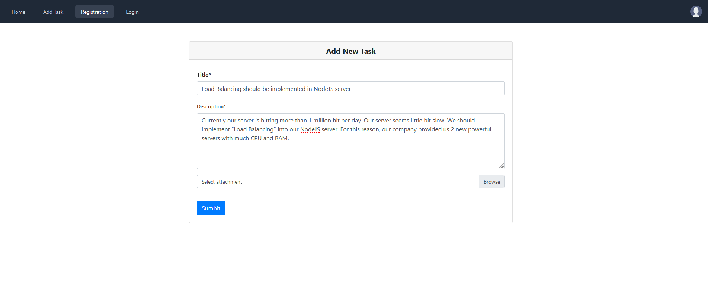
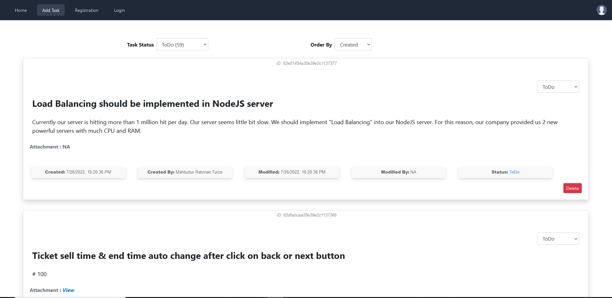
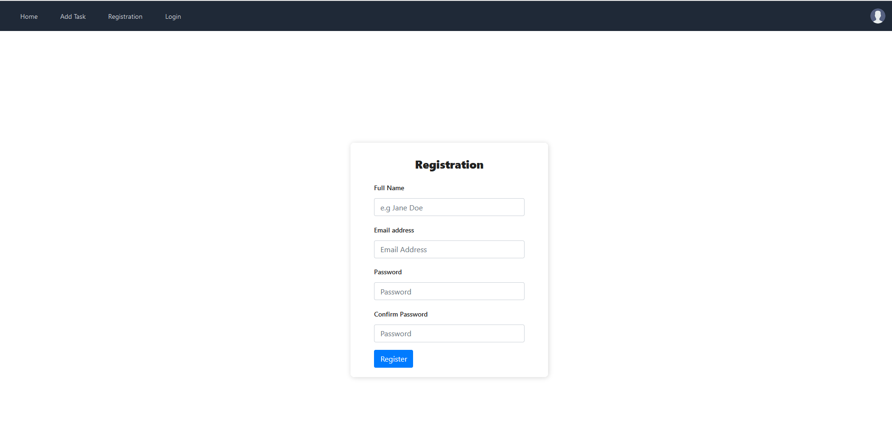
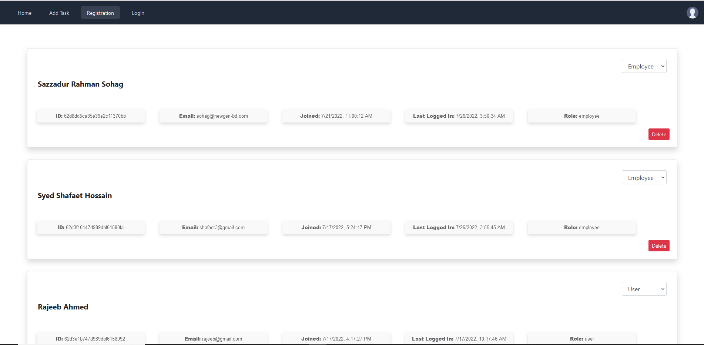

# Task Tracker Application

Developed By : [Mahbubur Rahman Turzo](https://github.com/Turzoxpress)

## Frontend : **ReactJS** ([Source Code](https://github.com/Turzoxpress/task-tracker-app-react-frontend))

## Backend : **NodeJS, Express** ([Source Code](https://github.com/Turzoxpress/task-tracker-app-node-backend))

## Database : **MongoDB**

Do you need to track ongoing tasks of your project? This is a fullstack application with complete frontend and backend. You are free to clone and use or modify as your needs!









## How to start ?

```
git clone https://github.com/Turzoxpress/task-tracker-app-react-frontend

npm i

npm start
```

Then browse ([http://localhost:4000](http://localhost:4000))

## Contributing

Pull requests are welcome. For major changes, please open an issue first to discuss what you would like to change.

## License

[MIT](https://choosealicense.com/licenses/mit/)
